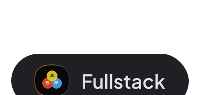

Nível 1 - Primeiros passos

Nessa módulo, exploramos detalhadamente os fundamentos essenciais da programação web, abordando tanto os princípios teóricos. 
Além disso,realizamos a configuração do ambiente de desenvolvimento.

    
Nível 2 - Versionamento de código

    

        Nessa módulo, exploramos os conceitos de controle de versão de código usando ferramentas como Git e o GitHub.
    

Nível 3 - Iniciando o HTML e CSS

Nessa módulo, exploramos os conceitos iniciais do HTML e CSS.

<ul>
    <li>Fundamentos HTML</li>
    <li>Fundamentos CSS</li>
    <li>Projeto: Página de Receita</li>
    <li>Desafio prático = Local Turístico</li>
</ul>

  
Nível 4 - Avançando no  o HTML e CSS

Nessa módulo, nos aprofundamos nas técnicas avançadas de HTML e CSS, proporcionando um domínio mais robusto dessas tecnologias essenciais para o desenvolvimento web.

<ul>
    <li>Layout com CSS</li>
    <li>Desafio prático - Portfólio Dev</li>
    <li>Formuários</li>
    <li>CSS Functions</li>
    <li>Responsividade</li>
    <li>CSS Animations & Transitions </li>
</ul>

## 💻 Projeto no Figma

[Página de Receita](https://www.figma.com/design/6OBtTV17g5UjgNcOpSb60X/P%C3%A1gina-de-receita-Rocketseat?node-id=908-1045&t=wpyNb2QwvoEijJUy-0)  
[Local Turítico](https://www.figma.com/design/qHoAl1dYOk8eFNlnSigGza/Local-Tur%C3%ADstico-Rocketseat?node-id=0-1&t=wZa79AF8fEoJoc2j-0)  
[Portfólio Dev](https://www.figma.com/design/4k8sCV1FFzFGQ3zBkDJxE7/Portfolio-Dev-Rock?node-id=0-1&t=0uZvkpHDEKPsVP02-0)
 

##

Feito com ☕ e 🖤 por Gelzieny R. Martins

